# Comparação de Estruturas

---
 
## Problema

Até o momento trabalhamos com três modelos de árvore, binária, avl e redblack. Chegou o momento de compararmos tais estruturas, observando seu comportamento sob diferentes volumes de dados. Para tanto, elabore arquivos que contenham 500 , 5.000 , 50.000 , 500.000 entradas numéricas do tipo ponto flutuante. Para tanto, tente evitar repetições de valores em grande escala para que possamos ter uma estrutura profunda. Considere produzir os menores a partir dos maiores volumes de forma randômica. Feito a isso, vamos testar os seguintes processos:

1. Qual o tempo gasto com pesquisa para um arquivo de entrada com 10.000 consultas. Considere como consulta a busca de um determinado número na estrutura escolhida. Para cada pesquisa, é preciso remover o elemento da árvore, retornando esse número para o usuário. Então, considere o processo de remoção como parte final do processo. 

2. Qual o tempo necessário para montar a estrutura em memória. 

3. Qual o ganho dessas estruturas ao compará-las a vetores ordenados e aplicados à pesquisa binária. Qual o tempo gasto com a ordenação do vetor? Foi possível produzi-lo em memória? 

4. Adotando como estrutura o map e unorder_map do C++, há ganhos maiores nesse processo de pesquisa?

Elabore um relatório detalhando a implementação dessas estruturas, funcionamento da aplicação, exemplo de resultado, modo de compilação e conclusões. Considere essa última seção como uma discussão de quando adotar cada estrutura acima citada e o por quê de tal escolha. Para toda essa discussão, apresentar gráficos que demonstrem os resultados obtidos durante o processo de análise.

---
## Implementação

### Menus 

Foi implementado um menu simples que da a opção ao usuário de qual estrutura ele deseja testar no momento, além de poder criar arquivos para o teste que será realizado. Ao selecionar uma das estruturas, o usuário cairá em outro menu, onde pode escolher qual arquivo quer testar (default é o de tamanho 500), se deseja já realizar o teste, ou se deseja voltar para o menu anterior. Não existe nenhum tipo de problema em realizar o teste diversas vezes em sequência, a estrutura é criada para realizar o teste e depois eliminada da memória, então um teste realizado em sequência não possui nenhuma vantagem estrutural ao realizado anteriormente.

### Arquivos

Como dito anteriormente, foi implementada uma opção para o usuário de criar arquivos aleatórios se assim desejar. Esses arquivos já conterão a quantidade de elementos requisitada pelo professor e sobreescreverão quaisquer arquivos que já existam e possuam o mesmo nome que o utilizado no programa. Os arquivos são feitos de forma proposital para que existam alguns elementos no arquivo de pesquisa que não existe em nenhum dos outros arquivos. Os arquivos utilizados na bateria de testes aqui demonstrada se encontram na pasta Files. Além deles, os seus resultados podem ser encontrados de forma individual em uma planilha de excel existente também dentro da pasta Files.

Uma atenção especial foi dada ao arquivo de pesquisa, já é checado antes mesmo do usuário tomar qualquer ação se este arquivo existe, e caso exista, seus dados são passados para um vector que será utilizado durante as pesquisas realizadas. Caso este arquivo não exista ao ser iniciado o programa, não é sequer possível ir para o menu de teste da estrutura sem antes possuir esse arquivo.

### Árvores

O importante para o exercício em questão era a comparação das estruturas, portanto o professor chegou a passar as estruturas básicas das [árvores binárias basicas](https://github.com/mpiress/basic_tree) e [árvores AVL](https://github.com/mpiress/avl_tree). A árvore RedBlack foi recolhida do [github do monitor da disciplina](https://github.com/danieldiv/comparacao-estrutura-arvore/blob/main/src/treeRB.c) ~~após muito apanhar e desistir de fazer por conta própria~~.

### Vector

O Vector inicialmente foi feito com um quick sort para sua inserção, no entanto, por mais que o quick sort seja rápido, para as entradas maiores o seu tempo era simplesmente inviável. Portanto, a inserção no vector foi feita pela criação de uma árvore binária padrão e em seguida foi utilizado o método central para a inserção dos dados dessa árvore no vector. Assim, não só agilizando o processo, como também filtrando qualquer dado repetido que poderia existir.

Para sua busca foi utilizada a Binary Search, padrão por ser a melhor busca possível para vetores ordenados, estando em O(log2n). As posições dos números encontrados foram salvos em um vetor que será utilizado posteriormente para a exclusão dos elementos deste vector.

Falar que por melhor que seja, daria problema se for eliminar milhões de dados por salvar milhões de posições.

### Map

### Unordered Map

---
## Resultados Testes
Foram executados baterias de testes em cada estrutura e para cada arquivo de entrada. Os testes foram feitos em um notebook que possui um i7-9750H, 8Gb de RAM, Windows 11 e está rodando o programa pelo Ubuntu via WSL. Essa bateria de testes consiste em 10 testes realizando o ciclo proposto no enunciado, onde são coletados os tempos de inserção nas estruturas, o tempo de pesquisa e o tempo de remoção.

Abaixo se encontram as tabelas com os tempos médios obtidos (e seus respectivos desvios padrões) e os gráficos destas tabelas, para mera visualização mais fácil se desejado.

### Inserção

<table class="tg">
<thead>
  <tr>
    <th class="tg-amwm">Arquivo</th>
    <th class="tg-amwm" colspan="6" style="text-align:center;">Tempo (μs)</th>
  </tr>
</thead>
<tbody>
  <tr>
    <td class="tg-baqh"></td>
    <td class="tg-baqh">Binária</td>
    <td class="tg-baqh">AVL</td>
    <td class="tg-baqh">RB</td>
    <td class="tg-baqh">Vector</td>
    <td class="tg-baqh">Map</td>
    <td class="tg-baqh">Unordered Map</td>
  </tr>
  <tr>
    <td class="tg-baqh">500</td>
    <td class="tg-baqh">4575,3 ± 584,1</td>
    <td class="tg-baqh">4316,2 ± 1025,2</td>
    <td class="tg-baqh">4459,5 ± 933,3</td>
    <td class="tg-baqh">3841,7 ± 512,7</td>
    <td class="tg-baqh">3583,6 ± 750,9</td>
    <td class="tg-baqh">3400,7 ± 664,5</td>
  </tr>
  <tr>
    <td class="tg-baqh">5.000</td>
    <td class="tg-baqh"> 8008,1 ± 1528,7</td>
    <td class="tg-baqh">10193,1 ± 1613,2</td>
    <td class="tg-baqh"> 9179,9 ± 1558,4</td>
    <td class="tg-baqh"> 7793,9 ± 1135,5</td>
    <td class="tg-baqh"> 8020,9 ± 783,1</td>
    <td class="tg-baqh"> 8656,1 ± 1738,8</td>
  </tr>
  <tr>
    <td class="tg-baqh">50.000</td>
    <td class="tg-baqh">55529,5 ± 4678,1</td>
    <td class="tg-baqh">61563,6 ± 3853,4</td>
    <td class="tg-baqh">55475,3 ± 5789,9</td>
    <td class="tg-baqh">43272,8 ± 1954,3</td>
    <td class="tg-baqh">59831,1 ± 3594,0</td>
    <td class="tg-baqh">54537,9 ± 5163,1</td>
  </tr>
  <tr>
    <td class="tg-baqh">500.000</td>
    <td class="tg-baqh">644837,3 ± 5851,8</td>
    <td class="tg-baqh">789930,6 ± 18103,9</td>
    <td class="tg-baqh">623260,1 ± 29136,0</td>
    <td class="tg-baqh">561283,1 ± 17801,9</td>
    <td class="tg-baqh">709655,9 ± 11649,2</td>
    <td class="tg-baqh">502718,1 ± 10702,7</td>
  </tr>
</tbody>
</table>

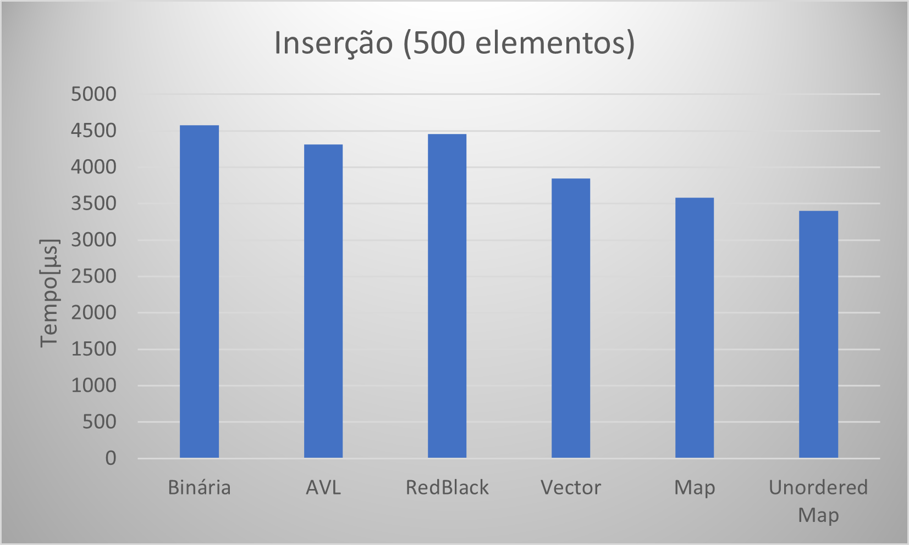
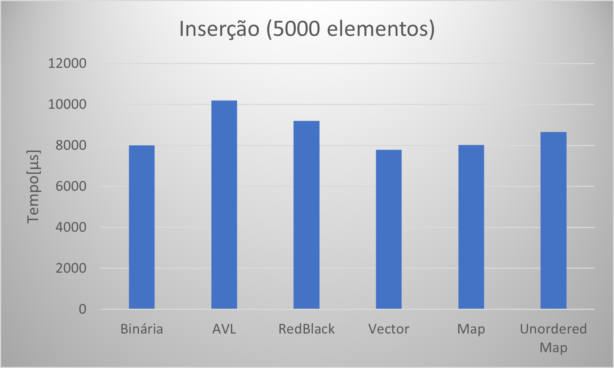
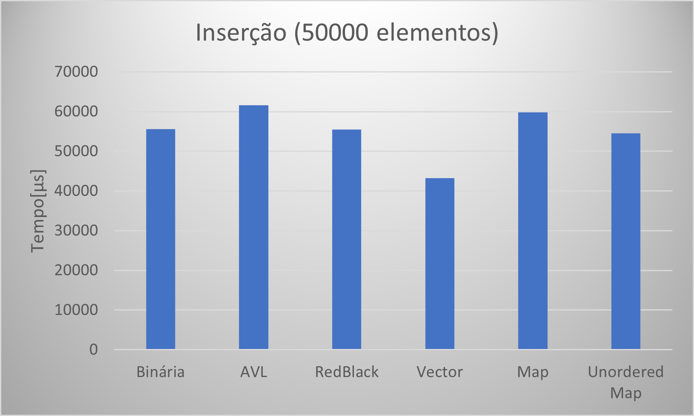
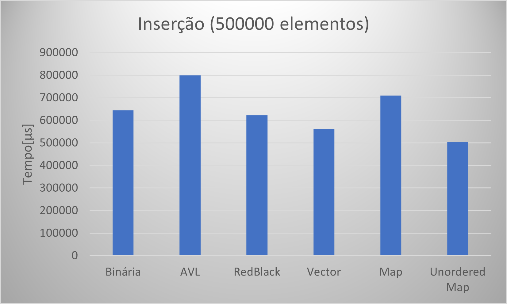

### Pesquisa

<table class="tg">
<thead>
  <tr>
    <th class="tg-amwm">Arquivo</th>
    <th class="tg-amwm" colspan="6" style="text-align:center;">Tempo (μs)</th>
  </tr>
</thead>
<tbody>
  <tr>
    <td class="tg-baqh"></td>
    <td class="tg-baqh">Binária</td>
    <td class="tg-baqh">AVL</td>
    <td class="tg-baqh">RB</td>
    <td class="tg-baqh">Vector</td>
    <td class="tg-baqh">Map</td>
    <td class="tg-baqh">Unordered Map</td>
  </tr>
  <tr>
    <td class="tg-baqh">500</td>
    <td class="tg-baqh">1429,2 ± 287,5</td>
    <td class="tg-baqh">1439,4 ± 261,7</td>
    <td class="tg-baqh">1505,3 ± 327,9</td>
    <td class="tg-baqh">4443,1 ± 603,4</td>
    <td class="tg-baqh">2796,3 ± 419,9</td>
    <td class="tg-baqh">1839,9 ± 260,2</td>
  </tr>
  <tr>
    <td class="tg-baqh">5.000</td>
    <td class="tg-baqh">2150,0 ± 444,0</td>
    <td class="tg-baqh">2601,1 ± 662,8</td>
    <td class="tg-baqh">2509,4 ± 553,9</td>
    <td class="tg-baqh">9529,0 ± 231,7</td>
    <td class="tg-baqh">3879,1 ± 340,6</td>
    <td class="tg-baqh">3066,6 ± 729,0</td>
  </tr>
  <tr>
    <td class="tg-baqh">50.000</td>
    <td class="tg-baqh">2740,7 ± 197,3</td>
    <td class="tg-baqh">2832,4 ± 222,5</td>
    <td class="tg-baqh">2896,0 ± 226,2</td>
    <td class="tg-baqh">59886,0 ± 1599,0</td>
    <td class="tg-baqh">11009,0 ± 639,6</td>
    <td class="tg-baqh">11169,5 ± 425,5</td>
  </tr>
  <tr>
    <td class="tg-baqh">500.000</td>
    <td class="tg-baqh">3637,4 ± 171,9</td>
    <td class="tg-baqh">4745,2 ± 317,1</td>
    <td class="tg-baqh">3718,4 ± 177,8</td>
    <td class="tg-baqh">603905,2 ± 18083,4</td>
    <td class="tg-baqh">96333,9 ± 4277,7</td>
    <td class="tg-baqh">122032,2 ± 1412,0</td>
  </tr>
</tbody>
</table>

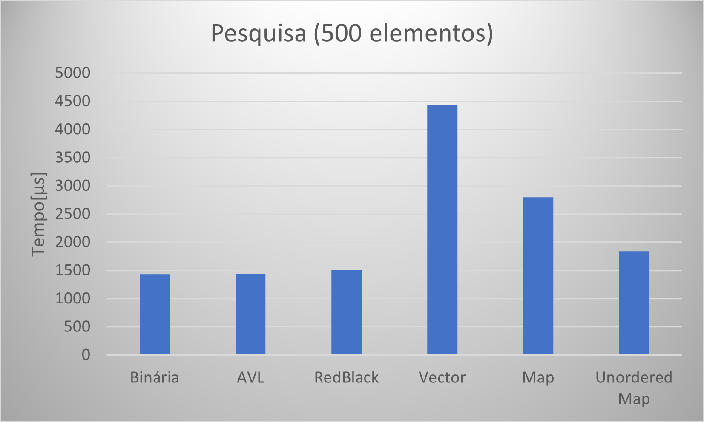
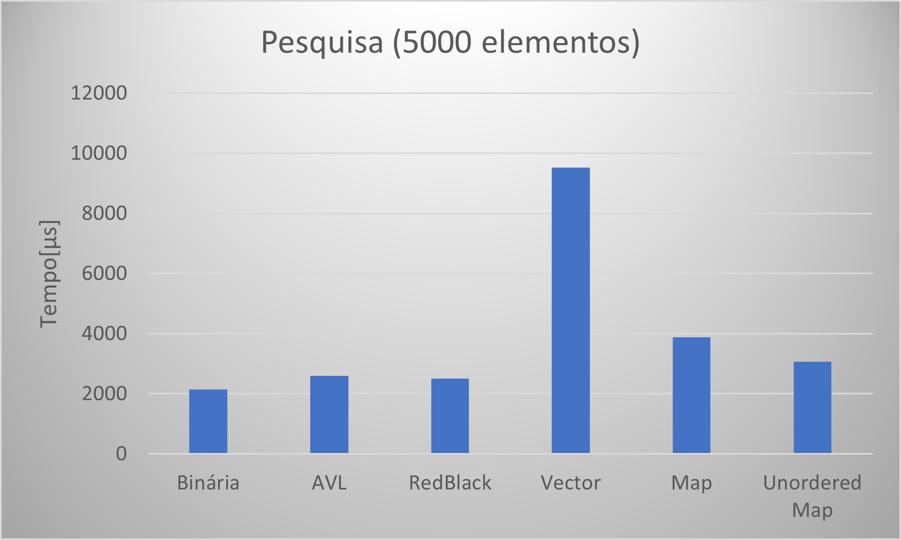

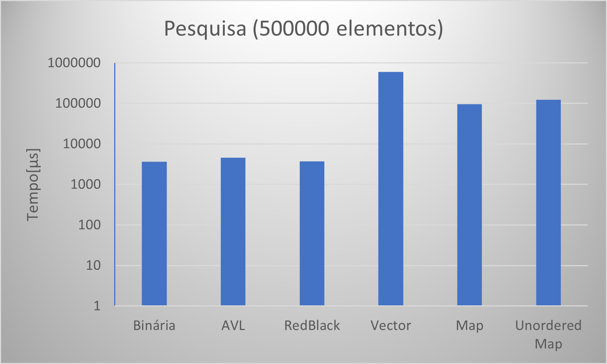

### Remoção
<table class="tg">
<thead>
  <tr>
    <th class="tg-amwm">Arquivo</th>
    <th class="tg-amwm" colspan="6" style="text-align:center;">Tempo (μs)</th>
  </tr>
</thead>
<tbody>
  <tr>
    <td class="tg-baqh"></td>
    <td class="tg-baqh">Binária</td>
    <td class="tg-baqh">AVL</td>
    <td class="tg-baqh">RB</td>
    <td class="tg-baqh">Vector</td>
    <td class="tg-baqh">Map</td>
    <td class="tg-baqh">Unordered Map</td>
  </tr>
  <tr>
    <td class="tg-baqh">500</td>
    <td class="tg-baqh">53,1 ± 13,3</td>
    <td class="tg-baqh">87,7 ± 27,6</td>
    <td class="tg-baqh">67,4 ± 15,6</td>
    <td class="tg-baqh">70,0 ± 15,4</td>
    <td class="tg-baqh">156,2 ± 24,34</td>
    <td class="tg-baqh">99,2 ± 17,8</td>
  </tr>
  <tr>
    <td class="tg-baqh">5.000</td>
    <td class="tg-baqh">955,6 ± 209,3</td>
    <td class="tg-baqh">1399,5 ± 353,9</td>
    <td class="tg-baqh">1166,8 ± 278,0</td>
    <td class="tg-baqh">859,1 ± 222,1</td>
    <td class="tg-baqh">2231,3 ± 225,6</td>
    <td class="tg-baqh">1330,0 ± 307,8</td>
  </tr>
  <tr>
    <td class="tg-baqh">50.000</td>
    <td class="tg-baqh">3168,7 ± 130,0</td>
    <td class="tg-baqh">3717,4 ± 196,7</td>
    <td class="tg-baqh">3116,2 ± 437,7</td>
    <td class="tg-baqh">14209,0 ± 359,1</td>
    <td class="tg-baqh">7064,3 ± 534,8</td>
    <td class="tg-baqh">2659,0 ± 271,0</td>
  </tr>
  <tr>
    <td class="tg-baqh">500.000</td>
    <td class="tg-baqh">7027,6 ± 248,0</td>
    <td class="tg-baqh">9181,7 ± 588,2</td>
    <td class="tg-baqh">6464,9 ± 243,8</td>
    <td class="tg-baqh">209612,6 ± 2616,3</td>
    <td class="tg-baqh">22746,6 ± 461,4</td>
    <td class="tg-baqh">4342,5 ± 99,0</td>
  </tr>
</tbody>
</table>

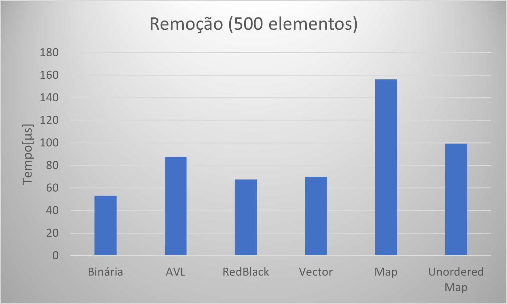
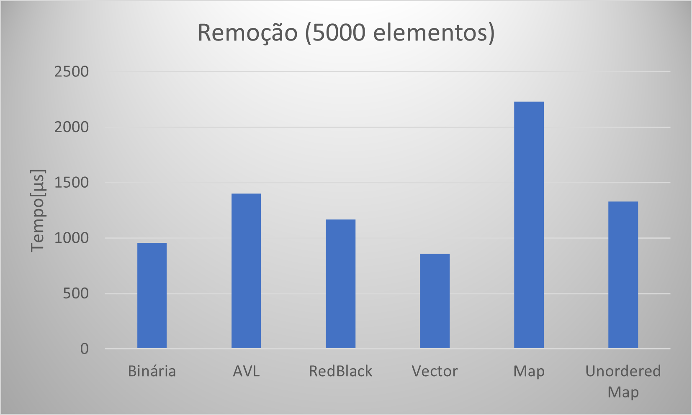
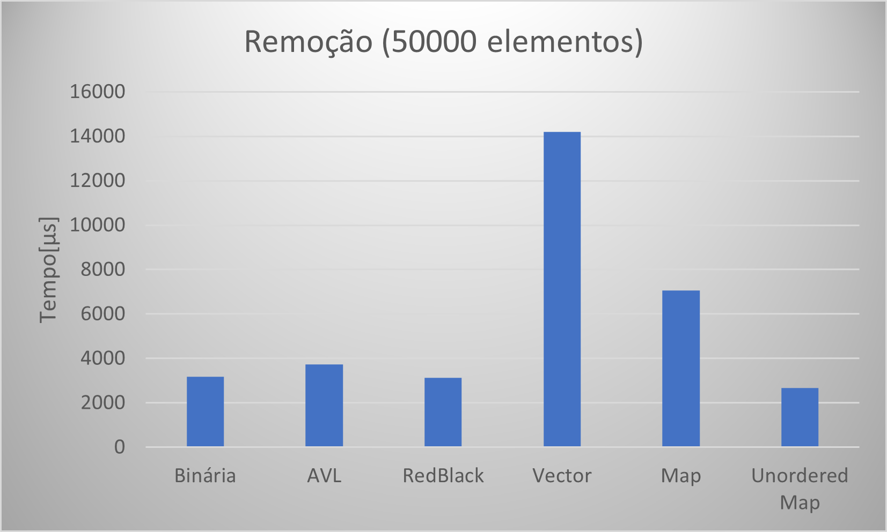
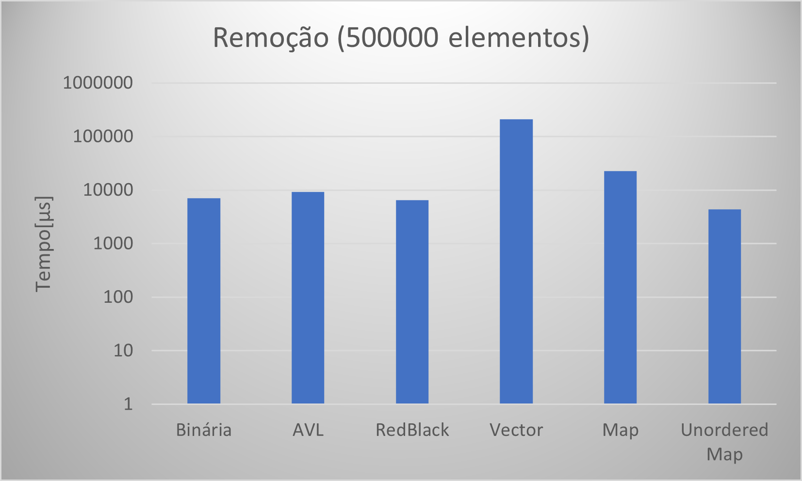
---
## Discussão

---

## Compilação e Execução

O exercício disponibilizado possui um arquivo Makefile cedido pelo professor que realiza todo o procedimento de compilação e execução. Para tanto, temos as seguintes diretrizes de execução:

| Comando                |  Função                                                                                           |                     
| -----------------------| ------------------------------------------------------------------------------------------------- |
|  `make clean`          | Apaga a última compilação realizada contida na pasta build                                        |
|  `make`                | Executa a compilação do programa utilizando o gcc, e o resultado vai para a pasta build           |
|  `make run`            | Executa o programa da pasta build após a realização da compilação                                 |
