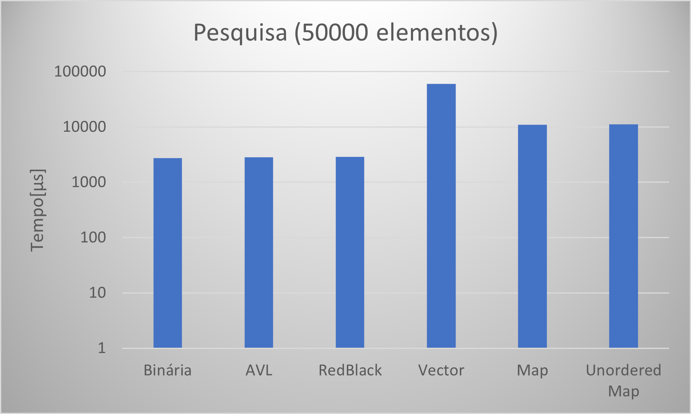

# Comparação de Estruturas

---
 
## Problema

Até o momento trabalhamos com três modelos de árvore, binária, avl e redblack. Chegou o momento de compararmos tais estruturas, observando seu comportamento sob diferentes volumes de dados. Para tanto, elabore arquivos que contenham 500 , 5.000 , 50.000 , 500.000 entradas numéricas do tipo ponto flutuante. Para tanto, tente evitar repetições de valores em grande escala para que possamos ter uma estrutura profunda. Considere produzir os menores a partir dos maiores volumes de forma randômica. Feito a isso, vamos testar os seguintes processos:

1. Qual o tempo gasto com pesquisa para um arquivo de entrada com 10.000 consultas. Considere como consulta a busca de um determinado número na estrutura escolhida. Para cada pesquisa, é preciso remover o elemento da árvore, retornando esse número para o usuário. Então, considere o processo de remoção como parte final do processo. 

2. Qual o tempo necessário para montar a estrutura em memória. 

3. Qual o ganho dessas estruturas ao compará-las a vetores ordenados e aplicados à pesquisa binária. Qual o tempo gasto com a ordenação do vetor? Foi possível produzi-lo em memória? 

4. Adotando como estrutura o map e unorder_map do C++, há ganhos maiores nesse processo de pesquisa?

Elabore um relatório detalhando a implementação dessas estruturas, funcionamento da aplicação, exemplo de resultado, modo de compilação e conclusões. Considere essa última seção como uma discussão de quando adotar cada estrutura acima citada e o por quê de tal escolha. Para toda essa discussão, apresentar gráficos que demonstrem os resultados obtidos durante o processo de análise.

---
## Implementação

### Menus 

Foi implementado um menu simples que da a opção ao usuário de qual estrutura ele deseja testar no momento, além de poder criar arquivos para o teste que será realizado. Ao selecionar uma das estruturas, o usuário cairá em outro menu, onde pode escolher qual arquivo quer testar (default é o de tamanho 500), se deseja já realizar o teste, ou se deseja voltar para o menu anterior. Não existe nenhum tipo de problema em realizar o teste diversas vezes em sequência, a estrutura é criada para realizar o teste e depois eliminada da memória, então um teste realizado em sequência não possui nenhuma vantagem estrutural ao realizado anteriormente.

### Arquivos

Como dito anteriormente, foi implementada uma opção para o usuário de criar arquivos aleatórios se assim desejar. Esses arquivos já conterão a quantidade de elementos requisitada pelo professor e sobreescreverão quaisquer arquivos que já existam e possuam o mesmo nome que o utilizado no programa. Os arquivos são feitos de forma proposital para que existam alguns elementos no arquivo de pesquisa que não existe em nenhum dos outros arquivos. Os arquivos utilizados na bateria de testes aqui demonstrada se encontram na pasta Files. Além deles, os seus resultados podem ser encontrados de forma individual em uma planilha de excel existente também dentro da pasta Files.

Uma atenção especial foi dada ao arquivo de pesquisa, já é checado antes mesmo do usuário tomar qualquer ação se este arquivo existe, e caso exista, seus dados são passados para um vector que será utilizado durante as pesquisas realizadas. Caso este arquivo não exista ao ser iniciado o programa, não é sequer possível ir para o menu de teste da estrutura sem antes possuir esse arquivo.

### Árvores

O importante para o exercício em questão era a comparação das estruturas, portanto o professor chegou a passar as estruturas básicas das <a href="https://github.com/mpiress/basic_tree">árvores binárias basicas</a> e <a href="https://github.com/mpiress/avl_tree">árvores AVL(</a>. A árvore RedBlack foi recolhida do <a href="https://github.com/danieldiv/comparacao-estrutura-arvore/blob/main/src/treeRB.c">GitHub do monitor da disciplina</a> <del>após muito apanhar e desistir de fazer por conta própria</del>.

### Vector

O Vector inicialmente foi feito com um quick sort para sua inserção, no entanto, por mais que o quick sort seja rápido, para as entradas maiores o seu tempo era simplesmente inviável, gastando tanto tempo que sequer pensar em comparar com as árvores já seria algo inviável por natureza. Portanto, a inserção no vector foi feita pela criação de uma árvore binária padrão e em seguida foi utilizado o método central para a inserção dos dados dessa árvore no vector. Assim, não só agilizando o processo, como também filtrando qualquer dado repetido que poderia existir. Deixando as comparações posteriores mais justas dado que o vector não terá que lidar com valores repetidos, igual todas as outras estruturas.

Para sua busca foi utilizada a Binary Search, padrão por ser a melhor busca possível para vetores ordenados, estando em O(log2n). As posições dos números encontrados foram salvas em um vetor que será utilizado posteriormente para a exclusão dos elementos deste vector. Ou seja, o Vector será a única estrutura que não precisará pesquisar novamente os itens que deseja remover.

### Map e Unordered Map

Não é necessário citar muito sobre essas duas estruturas além de que de acordo com o <a href="https://cplusplus.com/reference/map/map/">próprio site de documentação oficial do C++</a>, Maps são "tipícamente implementados como binary trees", porém sabemos mais especificamente que são árvores Red-Black. Enquanto os Unoredered Maps são utilizados Hash Tables, como também é citado no <a href="https://cplusplus.com/reference/unordered_map/unordered_map/">site de documentação oficial do C++</a>. Portanto, espera-se que a RedBlack e o Map tenham resultados parecidos.

### Pesquisa e Remoção

Como dito anteriormente, o Vector salvará as posições que estão contidos os elementos que precisará eliminar, o mesmo não pode ser feito para nenhuma das outras estruturas sem algo mais trabalhado, como salvar os iteradores ou algo do tipo. Porém, como a pesquisa já é realizada de qualquer forma, dois dados retornaram delas: o número de "não encontrados" nas pesquisas e um vetor de ponto flutuante, sendo este vetor os pontos flutuantes encontrados e que precisaram ser eliminados das outras estruturas. Assim, elas no mínimo não precisarão realizar pesquisas por elementos que já sabemos que não se encontram em sua estrutura.

---
## Resultados Testes

Foram executadas baterias de testes em cada estrutura e para cada arquivo de entrada. Os testes foram feitos em um notebook que possui um <a href="https://www.intel.com/content/www/us/en/products/sku/191045/intel-core-i79750h-processor-12m-cache-up-to-4-50-ghz/specifications.html">i7-9750H</a>, 8Gb de RAM, Windows 11 e está rodando o programa pelo Ubuntu via WSL. Essa bateria de testes consiste em 10 testes realizando o ciclo proposto no enunciado, onde são coletados os tempos de inserção nas estruturas, o tempo de pesquisa e o tempo de remoção.

Abaixo se encontram as tabelas com os tempos médios obtidos (e seus respectivos desvios padrões) e os gráficos destas tabelas, para mera visualização mais fácil se desejado. É necessário comentar que existem 3 gráficos em escala logarítmica graças a discrepância dos resultados.

### Inserção

<table class="tg">
<thead>
  <tr>
    <th class="tg-amwm">Arquivo</th>
    <th class="tg-amwm" colspan="6" style="text-align:center;">Tempo (μs)</th>
  </tr>
</thead>
<tbody>
  <tr>
    <td class="tg-baqh"></td>
    <td class="tg-baqh">Binária</td>
    <td class="tg-baqh">AVL</td>
    <td class="tg-baqh">RB</td>
    <td class="tg-baqh">Vector</td>
    <td class="tg-baqh">Map</td>
    <td class="tg-baqh">Unordered Map</td>
  </tr>
  <tr>
    <td class="tg-baqh">500</td>
    <td class="tg-baqh">4575,3 ± 584,1</td>
    <td class="tg-baqh">4316,2 ± 1025,2</td>
    <td class="tg-baqh">4459,5 ± 933,3</td>
    <td class="tg-baqh">3841,7 ± 512,7</td>
    <td class="tg-baqh">3583,6 ± 750,9</td>
    <td class="tg-baqh">3400,7 ± 664,5</td>
  </tr>
  <tr>
    <td class="tg-baqh">5.000</td>
    <td class="tg-baqh"> 8008,1 ± 1528,7</td>
    <td class="tg-baqh">10193,1 ± 1613,2</td>
    <td class="tg-baqh"> 9179,9 ± 1558,4</td>
    <td class="tg-baqh"> 7793,9 ± 1135,5</td>
    <td class="tg-baqh"> 8020,9 ± 783,1</td>
    <td class="tg-baqh"> 8656,1 ± 1738,8</td>
  </tr>
  <tr>
    <td class="tg-baqh">50.000</td>
    <td class="tg-baqh">55529,5 ± 4678,1</td>
    <td class="tg-baqh">61563,6 ± 3853,4</td>
    <td class="tg-baqh">55475,3 ± 5789,9</td>
    <td class="tg-baqh">43272,8 ± 1954,3</td>
    <td class="tg-baqh">59831,1 ± 3594,0</td>
    <td class="tg-baqh">54537,9 ± 5163,1</td>
  </tr>
  <tr>
    <td class="tg-baqh">500.000</td>
    <td class="tg-baqh">644837,3 ± 5851,8</td>
    <td class="tg-baqh">789930,6 ± 18103,9</td>
    <td class="tg-baqh">623260,1 ± 29136,0</td>
    <td class="tg-baqh">561283,1 ± 17801,9</td>
    <td class="tg-baqh">709655,9 ± 11649,2</td>
    <td class="tg-baqh">502718,1 ± 10702,7</td>
  </tr>
</tbody>
</table>

### Pesquisa

<table class="tg">
<thead>
  <tr>
    <th class="tg-amwm">Arquivo</th>
    <th class="tg-amwm" colspan="6" style="text-align:center;">Tempo (μs)</th>
  </tr>
</thead>
<tbody>
  <tr>
    <td class="tg-baqh"></td>
    <td class="tg-baqh">Binária</td>
    <td class="tg-baqh">AVL</td>
    <td class="tg-baqh">RB</td>
    <td class="tg-baqh">Vector</td>
    <td class="tg-baqh">Map</td>
    <td class="tg-baqh">Unordered Map</td>
  </tr>
  <tr>
    <td class="tg-baqh">500</td>
    <td class="tg-baqh">1429,2 ± 287,5</td>
    <td class="tg-baqh">1439,4 ± 261,7</td>
    <td class="tg-baqh">1505,3 ± 327,9</td>
    <td class="tg-baqh">4443,1 ± 603,4</td>
    <td class="tg-baqh">2796,3 ± 419,9</td>
    <td class="tg-baqh">1839,9 ± 260,2</td>
  </tr>
  <tr>
    <td class="tg-baqh">5.000</td>
    <td class="tg-baqh">2150,0 ± 444,0</td>
    <td class="tg-baqh">2601,1 ± 662,8</td>
    <td class="tg-baqh">2509,4 ± 553,9</td>
    <td class="tg-baqh">9529,0 ± 231,7</td>
    <td class="tg-baqh">3879,1 ± 340,6</td>
    <td class="tg-baqh">3066,6 ± 729,0</td>
  </tr>
  <tr>
    <td class="tg-baqh">50.000</td>
    <td class="tg-baqh">2740,7 ± 197,3</td>
    <td class="tg-baqh">2832,4 ± 222,5</td>
    <td class="tg-baqh">2896,0 ± 226,2</td>
    <td class="tg-baqh">59886,0 ± 1599,0</td>
    <td class="tg-baqh">11009,0 ± 639,6</td>
    <td class="tg-baqh">11169,5 ± 425,5</td>
  </tr>
  <tr>
    <td class="tg-baqh">500.000</td>
    <td class="tg-baqh">3637,4 ± 171,9</td>
    <td class="tg-baqh">4745,2 ± 317,1</td>
    <td class="tg-baqh">3718,4 ± 177,8</td>
    <td class="tg-baqh">603905,2 ± 18083,4</td>
    <td class="tg-baqh">96333,9 ± 4277,7</td>
    <td class="tg-baqh">122032,2 ± 1412,0</td>
  </tr>
</tbody>
</table>

### Remoção
<table class="tg">
<thead>
  <tr>
    <th class="tg-amwm">Arquivo</th>
    <th class="tg-amwm" colspan="6" style="text-align:center;">Tempo (μs)</th>
  </tr>
</thead>
<tbody>
  <tr>
    <td class="tg-baqh"></td>
    <td class="tg-baqh">Binária</td>
    <td class="tg-baqh">AVL</td>
    <td class="tg-baqh">RB</td>
    <td class="tg-baqh">Vector</td>
    <td class="tg-baqh">Map</td>
    <td class="tg-baqh">Unordered Map</td>
  </tr>
  <tr>
    <td class="tg-baqh">500</td>
    <td class="tg-baqh">53,1 ± 13,3</td>
    <td class="tg-baqh">87,7 ± 27,6</td>
    <td class="tg-baqh">67,4 ± 15,6</td>
    <td class="tg-baqh">70,0 ± 15,4</td>
    <td class="tg-baqh">156,2 ± 24,34</td>
    <td class="tg-baqh">99,2 ± 17,8</td>
  </tr>
  <tr>
    <td class="tg-baqh">5.000</td>
    <td class="tg-baqh">955,6 ± 209,3</td>
    <td class="tg-baqh">1399,5 ± 353,9</td>
    <td class="tg-baqh">1166,8 ± 278,0</td>
    <td class="tg-baqh">859,1 ± 222,1</td>
    <td class="tg-baqh">2231,3 ± 225,6</td>
    <td class="tg-baqh">1330,0 ± 307,8</td>
  </tr>
  <tr>
    <td class="tg-baqh">50.000</td>
    <td class="tg-baqh">3168,7 ± 130,0</td>
    <td class="tg-baqh">3717,4 ± 196,7</td>
    <td class="tg-baqh">3116,2 ± 437,7</td>
    <td class="tg-baqh">14209,0 ± 359,1</td>
    <td class="tg-baqh">7064,3 ± 534,8</td>
    <td class="tg-baqh">2659,0 ± 271,0</td>
  </tr>
  <tr>
    <td class="tg-baqh">500.000</td>
    <td class="tg-baqh">7027,6 ± 248,0</td>
    <td class="tg-baqh">9181,7 ± 588,2</td>
    <td class="tg-baqh">6464,9 ± 243,8</td>
    <td class="tg-baqh">209612,6 ± 2616,3</td>
    <td class="tg-baqh">22746,6 ± 461,4</td>
    <td class="tg-baqh">4342,5 ± 99,0</td>
  </tr>
</tbody>
</table>

---
## Discussão

O primeiro ponto a ser analizado foi a percepção de que todas as estruturas se tornaram menos impactadas por quaisquer processos que o computador estava fazendo enquanto se tornavam maiores. Para os arquivos menores, todas as estruturas testadas possuiam um desvio padrão alto em seus tempos, independente de qual ação estivessem realizando, próximos a 20%, e tornaram-se menores de 10% e até menores de 5% quando os arquivos testados eram de 50.000 ou 500.000 itens.

Além disso, foi perceptível que ou a massa de dados testada auxiliava demais a árvore binária padrão, ou simplesmente 500.000 elementos não são o suficiente para ser perceptível a melhora que as outras árvores dão. Pois a árvore binária padrão simplesmente possui o melhor tempo em todas as etapas destes arquivos maiores, sendo que graças a alta variação que ocorria em arquivos menores, foi possível ver um tempo médio menor para a Inserção da árvore AVL do que a própria padrão, mostrando que realmente a estrutura estava influenciando muito menos do que qualquer processo no background que estava ocorrendo.

Essa influência de processos externos fica ainda mais perceptível ao serem comparados os tempos de inserções da árvore Binária com o Vector, como demonstrado na figura abaixo.

A inserção do Vector foi feita criando-se uma árvore binária e depois lendo esta árvore binária, mesmo assim, na bateria de testes, o tempo de inserção do vector conseguiu ser menor do que o da própria árvore binária em todos os casos, sendo que a diferença na média foi de 2% no caso mais próximo e de incríveis 22% no caso mais distante.

Apesar dos tempos de inserção muito minimizados graças a estratégia utilizada, fica claro que o Vector perde por muito na pesquisa e na remoção. Foi graças a essa estrutura de dados que os últimos dois gráficos de pesquisa e o último de remoção acabou indo para a forma logaritmica, pois não era sequer possível ver mais os dados das três árvores iniciais quando eram colocadas lado a lado com o valor do Vector.
 

Além disso, a pesquisa binária utilizada e as árvores possuem ambas O(log2n) para pesquisa. Mesmo assim, por melhor que a busca binária seja, ela não se apresentou párea para a estrutura de uma árvore, e por mais que tenha eliminado o processo de pesquisa na remoção do vector, como esta estrutura é a única que precisa deslocar muitos de outros elementos (como mero exemplo, se fosse necessário eliminar o primeiro elemento do vector de 500.000 itens, precisaria se deslocar todos os outros 499.999 itens, por isso a remoção foi feita de trás para frente, para agilizar ainda mais o processo) após a exclusão de um único item seu, acaba tornando o processo muito mais caro do que os rebalanceamentos feitos na AVL e na RedBlack, principalmente quando se possui muitos itens. Uma alternativa possível seria a exclusão do ponto flutuante, mas não apagando em si a posição do Vector, porém isso iria de encontro com o que era feito nas outras estruturas e por isso simplesmente não foi feito, dado que o Vector já possuia regalias demais em comparação com as outras e mesmo assim não apresentava um resultado sequer comparável as demais.

Com essa diferença gritante em performance, a única conclusão possível envolvendo Vector, é que só é uma estrutura útil quando for uma quantidade de dados pequena, pois para grandes quantidade de dados se torna simplesmente inviável.

Focando então nas outras, como dito na implementação, um Map teoricamente é uma red black padrão do C++ e seus gráficos comparativos podem ser vistos abaixo:

A RedBlack padrão do C++, ou seja, o Map, possui uma performance para menores quantidades de dados acima da implementada neste trabalho na Inserção de dados. Porém, sua queda para maiores quantidades de dados é perceptível. A comparação entre as médias de ambas foi de 19.6% melhor quando comparados os 500 elementos, demontrando que a RedBlack implementada era muito mais lenta do que o Map, porém, a diferença foi de -13% quando comparados os 500.000 elementos, essa diferença foi de 19.6% para 12.8% com 5.000 elementos e para -7.85% para 50.000 elementos. Sendo que já foi dito que para as estruturas com poucos dados o simples background do computador rodando processos aleatórios provavelmente impactava mais do que a própria estrutura, se torna claro que não chega a ser absurdo declarar que a RedBlack implementada possui um rendimento melhor em geral que o Map do C++.

Além da Inserção, foi perceptível que a RedBlack implementada possui melhores resultados para Pesquisa e Remoção em qualquer momento. A estrutura Map em C++ é útil graças a sua facilidade de implementação, mas está longe de ser tão boa quanto as estruturas implementadas diretamente pelo usuário.

Agora, a análise final falará das três árvores mais o Unordered Map (Hash Table).

É perceptível que o Unordered Map foi muito bem em comparação com as estruturas implementadas, inclusive, sendo a estrutura padrão que conseguiu ser melhor no tempo de inserção para qualquer quantidade de dados. Acabou perdendo a performance na pesquisa e continuou sendo superior/igualitário na remoção. Essa discrepância no resultado da pesquisa poderia ocorrer graças ao tamanho da Hash Table que pode ser implementada pelo Unordered Map e assim ao se pesquisar acabava caindo em muitos casos de colisões. No entanto, essa performance muito boa das árvores, junto do resultado prévio do vector na pesquisa, acabou demonstrando para o aluno que havia alguma informação sendo perdida.

Após analisar melhor e pensar em possíveis razões para essa discrepância (além de colisões na Hash e um vector ser simplesmente pior sem razão), o aluno chegou a uma conclusão. Pela forma que os arquivos randômicos estão sendo formados neste trabalho, os elementos pesquisados provavelmente estão sempre próximos do topo da árvore gerada, tanto que não a toa, a árvore Binária padrão possui o menor tempo de pesquisa entre as 3 árvores implementadas mesmo não sendo balanceada de forma apropriada. A RedBlack que possui maior tolerância a árvores desbalanceadas acabou alterando menos a sua estrutura básica e por isso seu tempo de pesquisa também ficou menor quando comparada exclusivamente com a árvore AVL.
 

Assim, apesar de existir uma mudança na forma como a árvore se apresenta na AVL e na RedBlack, fica claro pelo desempenho quase igual em todos os tamanhos de estruturas, que o arquivo de Pesquisa feito não foi bem implementado, pois ele favorece as árvores, principalmente a binária, que nunca se altera com meras inserções de elementos. Esta analise gera alguns questionamento/pensamento, talvez seja por isso que o Vector, que possui uma busca binária com o mesmo O acabou se tornando pior, pois seus elementos estão ordenados de forma crescente, enquanto as árvores já estão sendo feitas de forma a serem favorecidas pelo arquivo de pesquisa. Isso acaba "invalidando" o resultado do Pesquisa do Vector pelo menos para ser comparado com as árvores, e talvez do próprio Unordered Map, dado que fica difícil comparar a pesquisa dessas estruturas com as das árvores sem se tornar algo injusto.

Apesar da qualidade ruim do arquivo de pesquisa, é necessário notar que outras coisas continuam valendo. O resultado ruim da Remoção do Vector continua horrível, dado que mesmo tendo a posição que deveria eliminar conseguiu ser pior graças ao analisado anteriormente. Além de ser notável outra coisa interessante ao se saber que o arquivo de pesquisa não foi bem formulado, é que apesar de ter os elementos introduzidos na mesma ordem que as árvores implementadas, o Map consegue de alguma forma piorar muito seu desempenho em pesquisa/remoção mesmo sendo teoricamente favorecido pelo arquivo de pesquisa iguais as outras. Se tornando uma incógnita de como esta estrutura RedBlack sequer conseguiu realizar esta façanha.

Para finalizar, com a descoberta do arquivo de pesquisa ruim, foi então analisado os tempos de pesquisa das duas estruturas que não se beneficiam deste tipo de arquivo. O Vector, que é ordenado logo na sua criação, e o Unordered Map, que teoricamente tem O(1).

Como esperado em uma comparação de performance entre uma busca em O(log2n) com uma busca idealmente em 1, o Unordered Map se provou muito superior em simplesmente todos os arquivos de entrada. A Hash implementada pelo C++ é grande e bem-feita o suficiente para garantir um tempo que começa em 58.6% menor e aumenta ainda mais a diferença com o passar do aumento do arquivo, indo para 79.8% quando comparados os tempos do arquivo de 500.000. Isso é esperado dado que o tempo de busca do vector depende de n, enquanto o da Hash depende do número de colisões, que em contrapartida depende do tamanho da Hash, sendo idealmente um tamanho infinito e o número de colisões igual a 0. Ficando assim a dúvida sobre qual seria a comparação entre a Hash e as árvores caso o arquivo de pesquisa fosse bem feito, pois as árvores teoricamente possuem o mesmo caso médio que a busca binária em um vetor ordenado.

---
## Compilação e Execução

O exercício disponibilizado possui um arquivo Makefile cedido pelo professor que realiza todo o procedimento de compilação e execução. Para tanto, temos as seguintes diretrizes de execução:

| Comando                |  Função                                                                                           |                     
| -----------------------| ------------------------------------------------------------------------------------------------- |
|  `make clean`          | Apaga a última compilação realizada contida na pasta build                                        |
|  `make`                | Executa a compilação do programa utilizando o gcc, e o resultado vai para a pasta build           |
|  `make run`            | Executa o programa da pasta build após a realização da compilação                                 |
